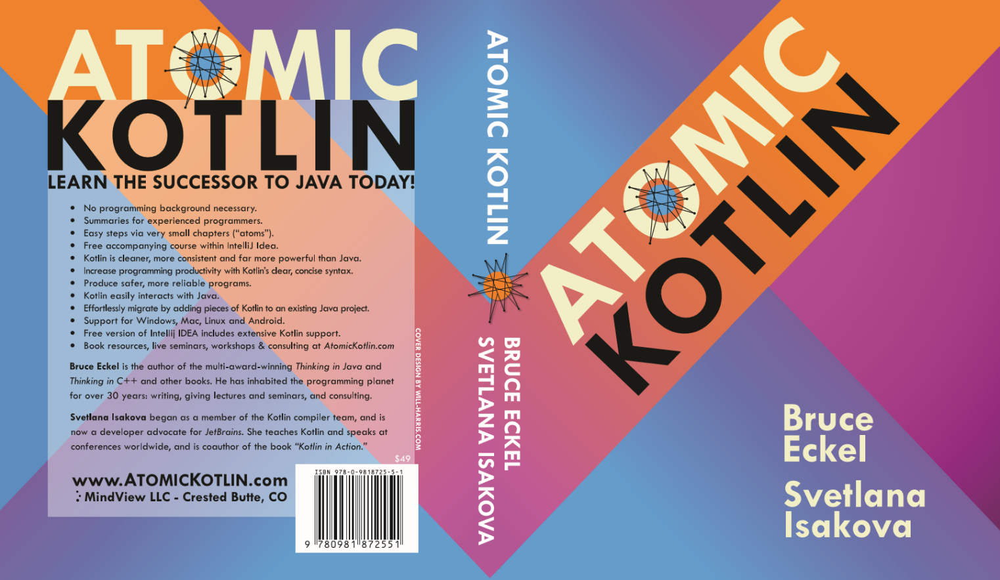

# 《Atomic Kotlin》中文版

  
  
  

**🤗 最近备战考研中，期望愿意翻译的你参与进来，欢迎 PR**

> 以下信息来自 Atomic Kotlin 官网：https://www.atomickotlin.com/

**《Atomic Kotlin》** 及配套学习资源由 Bruce Eckel 和 Svetlana Isakova 合著。

- [为什么学习 Kotlin？](https://blog.jetbrains.com/kotlin/2021/04/why-learn-kotlin/)
- [JetBrains Connect, Episode 4 – “Why Kotlin?” with Bruce Eckel and Svetlana Isakova](https://www.youtube.com/watch?v=0V-qp-qpjzU)
- 2021 年 1 月 11 日：纸质书出版。
- 2020 年 12 月 9 日：电子书完成，并在 [Leanpub](https://leanpub.com/AtomicKotlin) 发布。
- 原以为本书已经完成了，但经过反复翻阅，我们最终发现了很多需要改进的地方，并根据 Kotlin 1.4 新增了一些资料。现在是真的完成了，这是印刷出来的版本。感谢你的耐心等候，希望你喜欢这本书！

**印刷书封面：**

